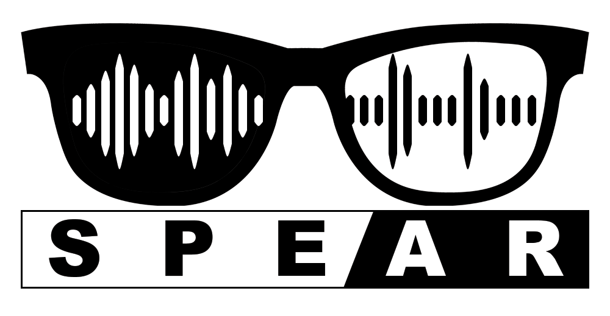
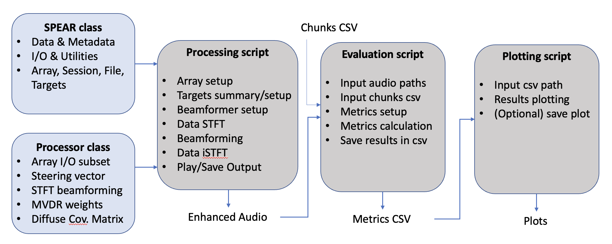

# SPEAR-tools

<p align="center">
  
</p>

This repository countains the code to compute the baseline and run the metrics used in the [SPEAR challenge](https://imperialcollegelondon.github.io/spear-challenge/).

## List of metrics

Category | Metric | Metric Abbreviation | Reference | Python Package
--- | ---:     | ---:          | ---:      | ---:
SNR      | Signal to Noise Ratio                     | SNR                 | [-]                            | [PySEPM](https://github.com/schmiph2/pysepm)
SNR      | Frequency weighted Segmental SNR          | fwSegSNR            | Hu et al. 2008 [^4]            | [PySEPM](https://github.com/schmiph2/pysepm)
SI       | Short Time Objective Intelligibility      | STOI                | Taal et al. 2011 [^5]          | [PYSTOI](https://github.com/mpariente/pystoi)
SI       | Extended STOI                             | ESTOI               | Jensen et al. 2016 [^6]        | [PYSTOI](https://github.com/mpariente/pystoi)
SI       | Modified Binaural STOI                    | MBSTOI              | Andersen et al. 2018 [^9]      | [CLARITY](https://claritychallenge.github.io)
SI       | Speech to Artifacts Ratio                 | SAR                 | Vincent et al. 2006 [^7]       | [Speech Metric](https://github.com/aliutkus/speechmetrics)
SI       | Image to Spatial Ratio                    | ISR                 | Vincent et al. 2006 [^7]       | [Speech Metric](https://github.com/aliutkus/speechmetrics)
SI       | Speech to Distortion Ratio                | SDR                 | Vincent et al. 2006 [^7]       | [Speech Metric](https://github.com/aliutkus/speechmetrics)
SI       | Scale Invariant SDR                       | SI-SDR              | Roux et al. 2019 [^15]         | [Speech Metric](https://github.com/aliutkus/speechmetrics)
SI       | Hearing Aid Speech Perception Index       | HASPI               | Kates et al. 2014 [^10] [^11]  | [CLARITY](https://github.com/claritychallenge/clarity)
SQ       | Perceptual Evaluation of Speech Quality   | PESQ                | Rix et al 2001 [^12]           | [Speech Metric](https://github.com/aliutkus/speechmetrics)
SQ       | PESQ Narrow Band                          | PESQ-NB             | Rix et al 2001 [^12]           | [Speech Metric](https://github.com/aliutkus/speechmetrics)


## Installation

```bash
# First clone the repo
git clone https://github.com/ImperialCollegeLondon/spear-tools
cd spear-tools

# Second create & activate environment with conda
conda env create --file environment.yaml
conda activate spear-tools-env
```

## How to Use

The main script to use is __batch_master.py__. 
The path of spear-tools and SPEAR data are assumed to be in the same directory. If not modify the parameter __path_SSD__.
The following parameters can be modified

```python
### Parameters
choose_set  = 'Train' # Choose to work in Train/Dev/Eval set
list_cases  = ['D2',1, 'M00'] # Choose subset to investigate. Use [] if all the set is of interest.
ToSave      = 1 # 0: dont/ 1: do save the plots
method_name = 'baseline' # Name of the currently tested method. Used for the output csv file name and processed audio folder
passthrough_only = False # Compute only the passthrough metrics and not the processed audio (baseline by default).

### Choose which section to run
run_processing    = True # Output processed and passthrough audio
run_evaluation    = False # Output csv file with all computed metrics on all chunks
run_visualisation = False # Output plots for all metrics
```

<!-- ## Repo Structure

The structure of the repo is as follow  

┬── **`Python`** (*directory*): Contains Python scripts to run the metrics.  
│   ├── **`Metrics`** (*directory*): Contains script for all metrics.  
│   │   └── **`###`** (*directories*): Directory with scripts to compute metric ###.  
│   ├── `SPEAR_metrics_main.py` (*file*): Main file used to run the metrics on Python.  
├── **`Matlab`** (*directory*): Contains Matlab scripts to run the metrics.  
│   ├── **`Metrics`** (*directory*): Contains script for all metrics.  
│   │   └── **`###`** (*directories*): Directory with scripts to compute metric ###.  
│   ├── `SPEAR_metrics_main.m` (*file*): Main file used to run the metrics on Matlab.  
├── **`Demo`** (*directory*): Contains some demo audio wav files with their associated metric values.  
│   ├── `DemoAudio_reference.wav` (*file*): Contains clean audio signal.  
│   ├── `DemoAudio_noise.wav` (*file*): Contains noisy audio signal.  
│   ├── `DemoAudio_metrics.png` (*file*): Image of table with all computed metrics of DemoAudio.  
│   └── `DemoAudio_metrics.json` (*file*): Json table with all computed metrics of DemoAudio.  
└── `README.md` (*file*): This readme markdown file.   -->


## Available Tools

<p align="center">
  
</p>

### Analysis tools

The provided framework consist of three main scripts:
- **Processing script** computes the baseline beamformer and output processed audio files.
- **Evaluation script** computes the metrics on the processed and passthrough audio files and output a csv file with all metrics for all chunks.
- **Plotting script** plot the results of the computed metrics csv file and save them.

More details about the scripts can be found in the powerpoint presentation in _assets_.
A master script is also provided to simply compute all three scripts on a subset of the dataset. Scripts can still be run individually if needed.

### Extra tools

The Matlab scripts to compute the chunk separation file is also provided as reference.

## References
<!-- EasyCom -->
[^1]: J. Donley, V. Tourbabin, J.-S. Lee, M. Broyles, H. Jiang, J. Shen, M. Pantic, V. K. Ithapu, and R. Mehra, “Easycom: An augmented reality dataset to support algorithms for easy communication in noisy environments,” 2021.
<!-- Tascar -->
[^2]: G. Grimm, J. Luberadzka, and V. Homann, “A toolbox for rendering virtual acoustic environments in the context of audiology,” _Acta Acustica united with Acustica_, vol. 105, no. 3, pp. 566–578, 2019.
<!-- SNR -->
[^3]: M. Cartwright, B. Pardo, G. J. Mysore, and M. Hoffman, “Fast and easy crowdsourced perceptual audio evaluation,” 2016.
<!-- (fw) SegSNR -->
[^4]: Y. Hu and P. C. Loizou, “Evaluation of objective quality measures for speech enhancement,” _IEEE Transactions on Audio, Speech, and Language Processing_, vol. 16, no. 1, pp. 229–238, 2008.
<!-- STOI -->
[^5]: C. H. Taal, R. C. Hendriks, R. Heusdens, and J. Jensen, “An algorithm for intelligibility prediction of time–frequency weighted noisy speech,” IEEE Transactions on Audio, Speech, and Language Processing, vol. 19, no. 7, pp. 2125–2136, 2011.
<!-- ESTOI -->
[^6]: J. Jensen and C. H. Taal, “An algorithm for predicting the intelligibility of speech masked by modulated noise maskers,” _IEEE/ACM Transactions on Audio, Speech, and Language Processing_, vol. 24, no. 11, pp. 2009–2022, 2016.
<!-- SDR -->
[^7]: E. Vincent, R. Gribonval, and C. F ́evotte, “Performance measurement in blind audio source separation,” _IEEE Transactions on Audio, Speech and Language Processing_, vol. 14, no. 4, pp. 1462–1469, 2006.
<!-- SIIB -->
[^8]: S. Van Kuyk, W. B. Kleijn, and R. C. Hendriks, “An instrumental intelligibility metric based on information theory,” _IEEE Signal Processing Letters_, vol. 25, no. 1, pp. 115–119, 2018.
<!-- MBSTOI -->
[^9]: A. H. Andersen, J. M. de Haan, Z.-H. Tan, and J. Jensen, “Refinement and validation of the binaural short time objective intelligibility measure for spatially diverse conditions,” _Speech Communication_, vol. 102, pp. 1–13, 2018.
<!-- HASPI -->
[^10]: J. M. Kates and K. H. Arehart, “The hearing-aid speech perception index (haspi),” _Speech Communication_, vol. 65, pp. 75–93, 2014.
[^11]: J. M. Kates and K. H. Arehart, “The hearing-aid speech perception index (haspi) version 2,” _Speech Communication_, vol. 131, pp. 35–46, 2021.
<!-- PESQ -->
[^12]: A. Rix, J. Beerends, M. Hollier, and A. Hekstra, “Perceptual evaluation of speech quality (pesq)-a new method for speech quality assessment of telephone networks and codecs,” in _2001 IEEE International Conference on Acoustics, Speech, and Signal Processing. Proceedings (Cat. No.01CH37221)_, vol. 2, pp. 749–752 vol.2, 2001.
<!-- VISQOL -->
[^13]: M. Chinen, F. S. C. Lim, J. Skoglund, N. Gureev, F. O’Gorman, and A. Hines, “Visqol v3: An open source production ready objective speech and audio metric,” 2020.
<!-- HASPI -->
[^14]: J. M. Kates and K. H. Arehart, “The hearing-aid speech quality index (hasqi) version 2,” _journal of the audio engineering society_, vol. 62, pp. 99–117, March 2014.
<!-- Clarity Challenge -->
[^15]: J. Barker, S. Graetzer, and T. Cox, “Software to support the 1st Clarity Enhancement Challenge [software and data collection],”
https://doi.org/10.5281/zenodo.4593856, 2021.